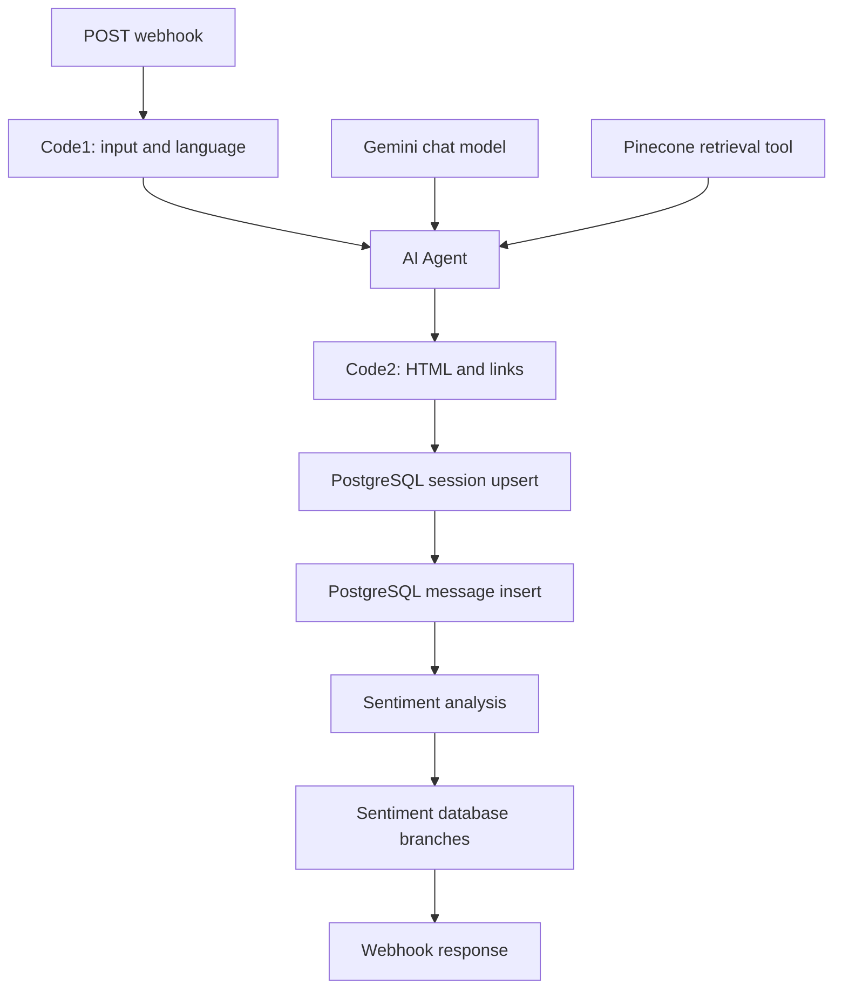

# AXI Chatbot

A multilingual website assistant for AXI Technologies, built with **n8n, Google Gemini, Pinecone, and PostgreSQL**. The project combines a company knowledge base with conversational responses in **English, Urdu, and Roman Urdu**, custom response formatting, and interaction logging.

Developed by **Abdur Rehman** during an Agentic AI internship at AXI Technologies.

> This repository contains an exported n8n workflow and its documentation. It is a project implementation snapshot, not a self-contained website or a verified production deployment. Credentials, the knowledge-base document, vector index contents, database schema migrations, and the website chat interface are not included.

## Contents

- [Project overview](#project-overview)
- [Repository files](#repository-files)
- [Architecture](#architecture)
- [Features](#features)
- [Multilingual response formatting](#multilingual-response-formatting)
- [Language detection](#language-detection)
- [Request and response contract](#request-and-response-contract)
- [Setup and configuration](#setup-and-configuration)
- [Validation checklist](#validation-checklist)
- [Export limitations and improvements](#export-limitations-and-improvements)

## Project overview

The assistant is designed to answer website visitors' questions about company services, products, careers, pricing, and meeting requests. An n8n AI Agent connects to Gemini and a Pinecone retrieval tool. Its prompt supplies company information and instructs the assistant to stay within the available context.

Responses support English, Urdu, and Roman Urdu through language detection, agent instructions, and language-specific HTML formatting.

## Repository files

| File | Purpose |
| --- | --- |
| [chatbot.json](chatbot.json) | Exported n8n workflow named `ChatBot(v2)` |
| [README.md](README.md) | Architecture, implementation notes, setup guidance, and limitations |

The export is marked inactive. Importing it does not configure its external services or activate a working public chatbot.

## Architecture

### Knowledge-base ingestion

1. **Google Drive Trigger** watches a configured knowledge-base file, with polling configured every minute.
2. **Download file** retrieves the document.
3. **Default Data Loader** supplies document data to the insertion node.
4. **Embeddings Google Gemini1** provides embeddings.
5. **Pinecone Vector Store** inserts the document data into the configured index.

This path populates the knowledge source used by the assistant. The export does not include the source document or existing vectors. Inspect update behavior before repeated ingestion; this snapshot does not show explicit deletion or replacement of older vectors.

### Chat processing



The diagram reflects the exported connections. Database logging and sentiment analysis run before the webhook response, so failures or delays in those stages can affect the request.

## Features

| Capability | Implementation in the export |
| --- | --- |
| English, Urdu, and Roman Urdu replies | Language heuristic in `Code1`, language instructions in the agent prompt, and formatting in `Code2` |
| Company knowledge retrieval | Gemini embeddings and a Pinecone tool connected to the AI Agent |
| Knowledge-base ingestion | Google Drive download, document loader, and Pinecone insertion |
| Pricing and meeting guidance | Prompt instructions and language-specific CTA labels |
| Careers guidance | Prompt routes career questions to the company's HR contact |
| HTML response formatting | Markdown link conversion, plain email/URL linking, and direction wrappers |
| Session records | PostgreSQL upsert keyed by user email |
| Conversation records | PostgreSQL insertion of input, output, timestamp, and execution identifier |
| Sentiment records | Gemini-backed sentiment analysis followed by database branches |

These are configured workflow capabilities. This repository does not provide execution results, automated tests, or measured accuracy and latency.

## Multilingual response formatting

The workflow formats replies according to the selected language:

| Language | Formatting behavior |
| --- | --- |
| English | The agent is instructed to reply in English; no full-response RTL wrapper is applied. |
| Urdu | The agent is instructed to preserve Urdu sentence flow and put necessary English terms in parentheses. The formatter applies an RTL HTML container. |
| Roman Urdu | The agent is instructed to use Latin script. The formatter removes characters in the `U+0600–U+06FF` range. |

For Urdu replies, `Code2` wraps the response in:

```html
<div dir="rtl" style="text-align:right;">
  ...response content...
</div>
```

The company name is normalized and rendered using an inline LTR span:

```html
<span dir="ltr" style="display:inline-block;">Axi-Technologies</span>
```

Existing Markdown links are protected during linkification, converted to HTML anchors, and given localized labels for booking and pricing actions.

Parenthesizing English terms depends on the agent prompt; the formatter does not automatically add parentheses around every term. Roman Urdu cleanup removes matching characters rather than transliterating them. Validate mixed-script rendering in the website interface, including Urdu phrases inside English responses.

## Language detection

`Code1` normalizes the company name, extracts message text, and produces `userText` and `replyLanguage`.

Its heuristic is:

| Condition | Selected language |
| --- | --- |
| Text contains a character in `U+0600–U+06FF` | `urdu` |
| No Latin alphabetic words are found | `english` |
| More than 40% of Latin words match a short English word list | `english` |
| Otherwise | `roman_urdu` |

This keeps detection lightweight and transparent, but it is not a trained language classifier. Technical English with few common words can be classified as Roman Urdu, and any matching Urdu/Arabic-block character takes precedence over the English ratio.

The agent prompt independently asks the model to match the user's language. Ensure the detected language is preserved through the workflow so output formatting follows the same decision.

## Request and response contract

### Request

The webhook node is configured for **POST** at `abcd/chat`. Use the test or production URL shown by your own n8n instance.

The current downstream expressions expect these fields in the webhook body:

```json
{
  "name": "Demo User",
  "email": "demo@example.com",
  "contact": "0000000000",
  "message": "Aap ki web development services kya hain?"
}
```

This example uses synthetic contact information.

Although the extraction helper handles several possible message formats, later expressions still directly access `Webhook.body` and the agent receives `message`, not the normalized `userText`. Confirm the actual request shape, especially because raw-body handling is enabled on the webhook.

### Formatter output

`Code2` constructs an item with these fields:

```json
{
  "name": "Demo User",
  "email": "demo@example.com",
  "phone": "0000000000",
  "success": true,
  "reply": "<formatted response>",
  "replyLanguage": "roman_urdu",
  "cleaned": "<formatted response>",
  "links": []
}
```

This describes the formatter's intended output, **not a verified final HTTP response**. The exported response node returns all incoming items after the database and sentiment stages. Those stages may replace the formatter fields; configure the final response mapping before connecting a frontend.

## Setup and configuration

### Required services

- An n8n instance supporting the node types in `chatbot.json`.
- Google Gemini credentials for chat, embeddings, and sentiment analysis.
- Google Drive OAuth access to a knowledge-base document.
- A Pinecone index compatible with the configured embedding model.
- PostgreSQL access to the tables referenced by the workflow.
- A website chat interface that can send POST requests and safely render replies.

The repository does not specify a tested n8n version or pin a Gemini model identifier.

### Import and configure

1. Import [chatbot.json](chatbot.json) into n8n.
2. Rebind each credential to your own service account or API connection. Exported credential references do not supply working credentials.
3. Replace the Google Drive document selection with an authorized knowledge-base document.
4. Configure the Pinecone index for both insertion and retrieval, and check embedding compatibility.
5. Configure PostgreSQL and the expected tables.
6. Review the company-specific prompt content and links.
7. Resolve the data-flow issues listed below.
8. Execute the ingestion path and test retrieval.
9. Use the webhook's test URL to validate chat processing.
10. Activate the workflow only after checking the final HTTP response and frontend rendering.

### Database expectations

The export references these schema/table names and fields:

| Table | Fields referenced by the workflow |
| --- | --- |
| `chatbot.chatbot_sessions` | `user_email`, `user_name`, `user_number` |
| `chatbot.chat_messages` | `id`, `user_email`, `timestamp`, `input`, `output` |
| `chatbot.chat_sentiments` | `id`, `user_email`, `analyzed_at`, `sentiment_label`, `input`, `output` |

The session upsert requires a suitable unique constraint on `user_email`. Table creation scripts, complete types, and foreign-key definitions are not supplied.

## Validation checklist

These are suggested manual checks; they have not been executed as part of this documentation update.

| Case | What to inspect |
| --- | --- |
| English question | English reply, readable LTR text, correct language metadata |
| Urdu-script question | Urdu reply, RTL container, readable embedded English terms |
| Roman Urdu question | Latin-script reply without unexpected Urdu-script fragments |
| Urdu with an English technical term | Parenthesized term and natural surrounding sentence flow |
| English with an Urdu phrase | Whether the reply stays readable without changing the whole message direction |
| Pricing request | Relevant cost-calculator link and correct localized label |
| Meeting request | Relevant booking link and correct localized label |
| General information request | Relevant answer without unrelated CTAs |
| Missing knowledge | Fallback behavior without invented company details |
| Repeated interaction | Session upsert and separate message logging |
| Input containing an apostrophe | Safe database handling |
| Final webhook response | Chat reply fields survive logging and sentiment steps |
| Mobile and desktop rendering | Direction, wrapping, punctuation, and clickable links |

Record actual input/output examples before claiming that a case passes.

## Export limitations and improvements

The following points come from inspecting this workflow snapshot, not from running a deployment.

- **Language metadata continuity:** `Code2` reads `replyLanguage` from its incoming item. The export does not explicitly merge the `Code1` fields back after the AI Agent. Verify whether the agent preserves them in your n8n version; otherwise use an explicit merge or node reference.
- **Contact-field continuity:** the formatter similarly expects contact fields on its input. Confirm those fields survive the agent step.
- **Final response mapping:** database and sentiment nodes sit between the formatter and response node. Explicitly return the formatter's reply object if that is the frontend contract.
- **Database safety:** the session upsert interpolates user-provided values directly into SQL. Replace this with parameterized values before exposing it to untrusted input.
- **Sentiment branches:** the branch feeding `Insert rows in a table4` lacks a sentiment-label mapping and contains mappings that differ from the other branches. Check every branch and record the intended category.
- **HTML safety:** the formatter emits model-generated text as HTML without an explicit sanitization step. Apply an allowlist-based sanitization policy before rendering it.
- **Access and origin controls:** the webhook allows all origins and does not show an authentication configuration. Configure these for the intended deployment.
- **Prompt consistency:** some CTA rules call for conditional links while later rules call for both links on pricing requests. Consolidate the rules to avoid conflicting behavior.
- **Bidirectional coverage:** extend validation to numbers, punctuation, URLs, multiple English terms, and Urdu phrases inside English replies. Parentheses alone do not guarantee correct rendering.
- **Deployment evidence:** no frontend source, screenshots, automated tests, execution logs, or performance measurements are included.

Future improvements could include stronger language detection, explicit preservation of response metadata, bidirectional isolation for embedded phrases, consistent response schemas, and independent logging so analytics do not delay a chat response.

## Author

**Abdur Rehman**  
Agentic AI internship project at **AXI Technologies**

The workflow is documented here for technical review and project presentation.

